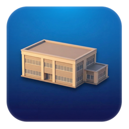

<p align="center">
  
</p>

# The Annex

[](https://github.com/ry4nolson/TheAnnex/actions/workflows/ci.yml)
[](https://github.com/ry4nolson/TheAnnex/releases/latest)
[](LICENSE)
[](https://github.com/ry4nolson/TheAnnex)
[](https://swift.org)
[](Tests/TheAnnexTests.swift)
[](https://www.texasbeardcompany.com)

A macOS menu bar app that syncs your Mac's folders to your NAS — and optionally symlinks them so your files live on the NAS while still feeling local.

## What Does The Annex Do?

Most NAS sync tools are clunky, require vendor lock-in, or don't integrate well with macOS. The Annex sits quietly in your menu bar and handles the boring parts — keeping your local folders backed up to your NAS and, if you want, making them *live* on the NAS transparently.

### Example: Offloading a project folder

You have `~/Projects` with 80 GB of repos and assets. Your MacBook is running low on space, but your Synology has terabytes free.

1. Add your NAS in The Annex (or let it auto-discover via Bonjour)
2. Add `~/Projects` as a sync folder pointed at `/volume1/Projects` on the NAS
3. Hit **Sync** — rsync pushes everything to the NAS with progress tracking
4. Enable **Symlink Mode** — The Annex replaces `~/Projects` with a symlink to the mounted NAS share

Now `~/Projects` reads and writes directly to the NAS. Your apps don't know the difference. If you take your laptop to a coffee shop and the NAS goes offline, The Annex automatically restores a local copy. When you get home, it syncs changes back and re-creates the symlink.

### Example: Backing up multiple Macs

You have a Mac Studio at your desk and a MacBook on the go. Both run The Annex pointed at the same NAS.

- The Studio syncs `~/Documents`, `~/Music`, and `~/Pictures` on a 5-minute interval
- The MacBook syncs `~/Documents` and `~/Desktop` whenever it's on the home WiFi (WiFi filtering keeps it from trying over a hotspot)

Each Mac gets its own NAS destination folder. The Activity Log and Statistics tabs show you exactly what synced, when, and how much data moved.

### Example: Managing multiple NAS devices

You have a primary Synology for everyday storage and a secondary QNAP for cold backups.

- Set the Synology as your default NAS for most sync folders
- Assign specific folders (like `~/Archives`) to the QNAP instead
- The Annex monitors both independently — online status, disk space, connection quality — all visible at a glance in the General tab

## Installation

### Download

Grab the latest `TheAnnex.zip` from [GitHub Releases](../../releases), unzip, and drag to `~/Applications`.

### Build from Source

```bash
git clone <repo-url>
cd TheAnnex
./build.sh
```

The app will be installed to `~/Applications/TheAnnex.app` and launched automatically.

### Requirements

- macOS 12.0 (Monterey) or later
- Xcode Command Line Tools (build from source only)
- Access to a NAS with SMB shares

## Features

### Multi-NAS Support
- Configure unlimited NAS devices with per-device credentials
- Bonjour/mDNS network discovery — automatically finds any NAS advertising SMB
- Set a default NAS; assign individual sync folders to specific devices
- Per-device monitoring: online status, connection quality, disk space

### Sync Engine
- Queue-based sync with concurrent support (max 2 simultaneous)
- One-way sync: Local → NAS (rsync with `--update` to skip newer files)
- Cancel individual syncs or cancel all at once
- Per-folder sync on demand or sync all at once
- Rsync integration with progress tracking and bandwidth throttling
- Editable local and NAS paths per sync folder with folder browser

### Symlink Mode
- After syncing, replace the local folder with a symlink to the NAS — apps read/write directly to the NAS
- When the NAS goes offline, the symlink is removed and a local copy is restored automatically
- When the NAS comes back online, local changes are synced and the symlink is re-created
- **macOS-protected folders** (Desktop, Pictures, Documents, etc.) cannot be symlinked due to System Integrity Protection — these are automatically detected and run in sync-only mode with a clear "Sync only (macOS protected)" label
- Symlink mode can be toggled per folder

### Monitoring
- Live connection quality (latency, packet loss) per NAS
- Disk space monitoring with progress bars
- Auto-mount SMB shares when NAS comes online
- Configurable check intervals (30s to 30min)
- Real-time updates on the General settings tab

### User Interface
- **General** — NAS devices, network discovery, monitoring dashboard, startup options
- **Sync Folders** — Visual list of sync pairs with status, clickable paths that open in Finder, add/edit/delete with folder browser
- **Activity Log** — Searchable, filterable log with export
- **Statistics** — Transfer metrics, success rates, charts (macOS 13+)
- **Advanced** — Bandwidth limits, WiFi filtering, power management, personality mode, custom rsync flags
- **About** — Version info (read from bundle), check for updates, app icon

### Menu Bar
- Dynamic status icon (connected/offline/syncing)
- Quick access to sync folders and shares
- Active sync progress with per-job cancel
- Recent activity feed
- Cancel all syncs

### Updates
- Automatic update check on startup — notifies when a new version is available on GitHub
- One-click link to the latest release page
- Manual check available in the About tab

### Security
- Keychain integration for NAS passwords (per-device)
- Developer ID code signing with Apple notarization

### Personality
- Optional "Annex personality" mode with fun quotes in notifications, logs, and empty states
- Toggle on/off in Advanced settings

## Getting Started

1. Launch The Annex — it appears in your menu bar
2. The welcome screen walks you through first-time setup
3. In **General**, click **Add NAS** → **Scan Network** to auto-discover your NAS
4. Enter credentials and shares, click **Add**
5. Go to **Sync Folders** → **Add Folder** → pick a preset or custom folder
6. Click **Sync All** or let the automatic check interval handle it

## Releasing

CI runs on every push to `main`. Releases are triggered by version tags.

### Creating a Release

```bash
./release.sh patch   # 1.0.0 → 1.0.1
./release.sh minor   # 1.0.1 → 1.1.0
./release.sh major   # 1.1.0 → 2.0.0
```

This bumps the version in `Info.plist`, commits, tags, and pushes. GitHub Actions builds the app and publishes `TheAnnex.zip` to Releases automatically.

## Architecture

```
TheAnnex/
├── main.swift                          # Entry point
├── build.sh                            # Local build script
├── release.sh                          # Semver bump + tag + push
├── Info.plist                          # App metadata & version
├── AppIcon.appiconset/                 # App icon assets
├── Models/
│   ├── NASState.swift
│   ├── NASDevice.swift
│   ├── SyncFolder.swift
│   ├── SyncJob.swift
│   ├── ActivityEntry.swift
│   └── Statistics.swift
├── Controllers/
│   ├── AppDelegate.swift
│   ├── AppState.swift
│   ├── MainWindowController.swift
│   ├── SyncEngine.swift
│   └── NASMonitor.swift
├── Views/
│   ├── GeneralSettingsView.swift
│   ├── SyncFoldersView.swift
│   ├── ActivityLogView.swift
│   ├── StatisticsView.swift
│   ├── AdvancedSettingsView.swift
│   └── AboutView.swift
├── Utilities/
│   ├── ShellHelper.swift
│   ├── RsyncWrapper.swift
│   ├── SymlinkManager.swift
│   ├── UpdateChecker.swift
│   ├── NetworkDetector.swift
│   ├── NASDiscovery.swift
│   ├── KeychainHelper.swift
│   └── AnnexQuotes.swift
├── Tests/
│   └── TheAnnexTests.swift
└── .github/workflows/
    ├── ci.yml                          # Build on push/PR to main
    └── release.yml                     # Build + publish on version tags
```

### Key Technologies

- **SwiftUI** — UI framework
- **Combine** — Reactive state management
- **Network.framework** — Bonjour/mDNS NAS discovery
- **Rsync** — File synchronization
- **CoreWLAN** — WiFi network detection
- **IOKit** — Power state detection
- **Security.framework** — Keychain credential storage

## Testing

```bash
./test.sh
```

174 assertions across 19 test suites covering all models, utilities, and controller logic. Tests run in CI on every push and PR.

## Troubleshooting

### NAS Won't Connect
1. Verify hostname: `ping YourNAS.local`
2. Check credentials
3. Ensure SMB is enabled on the NAS

### Sync Fails
1. Check the **Activity Log** for errors
2. Verify NAS paths exist and are writable
3. Ensure sufficient disk space

### Shares Won't Mount
1. Try mounting manually in Finder: `smb://YourNAS.local/share`
2. Check firewall settings
3. Review Activity Log for mount errors

### NAS Not Found in Scan
1. Ensure your NAS advertises SMB via Bonjour/mDNS
2. Check that both devices are on the same network/subnet
3. Try entering the hostname manually

## Website

The marketing site lives in `website/` and deploys to [theannex.app](https://theannex.app) via Netlify.

### Required Environment Variables (Netlify)

| Variable | Purpose |
|---|---|
| `STRIPE_SECRET_KEY` | Stripe secret key for checkout |
| `STRIPE_PRICE_ID` | Stripe Price ID for the support payment |
| `GITHUB_TOKEN` | Fine-grained PAT with Issues read/write on `ry4nolson/TheAnnex` |
| `GITHUB_OWNER` | GitHub org/user (default: `ry4nolson`) |
| `GITHUB_REPO` | GitHub repo name (default: `TheAnnex`) |
| `TURNSTILE_SECRET_KEY` | Cloudflare Turnstile secret key (server-side) |
| `VITE_TURNSTILE_SITE_KEY` | Cloudflare Turnstile site key (client-side, prefixed with `VITE_` so Vite exposes it) |

Optional:

| Variable | Default | Purpose |
|---|---|---|
| `FEATURE_REQUESTS_LIST_LIMIT` | `30` | Max feature requests returned per page |
| `FEATURE_REQUESTS_RATE_DAYS` | `1` | Submissions allowed per IP per N days |

### Feature Requests

The `/feature-requests` page lets visitors submit ideas that become GitHub Issues with the `feature-request` label. Submissions are protected by Cloudflare Turnstile (CAPTCHA) and a one-request-per-day-per-IP throttle backed by Netlify Blobs.

To set up Turnstile, create a site at [dash.cloudflare.com/turnstile](https://dash.cloudflare.com/turnstile) and add the keys above.

The `GITHUB_TOKEN` needs a fine-grained personal access token with **Issues: Read and Write** permission scoped to the `ry4nolson/TheAnnex` repository.

## Sponsor

<a href="https://www.texasbeardcompany.com">
  
</a>

Proudly sponsored by [Texas Beard Company](https://www.texasbeardcompany.com).

## License

GPL-3.0 — free to use, modify, and share. Derivative works must remain open source. See [LICENSE](LICENSE) for details.
